# GPOT 快递管理系统 - 功能模块图

风格说明：顶层为系统名称，其下横向排列六个主模块，每个主模块下纵向列出子功能（与参考图一致）。

```mermaid
flowchart TB
    ROOT["GPOT 快递管理系统"]

    subgraph row[" "]
        direction LR
        M1["认证与登录模块"]
        M2["包裹入库模块"]
        M3["包裹在库与取件模块"]
        M4["异常件管理模块"]
        M5["消息通知模块"]
        M6["管理员统计模块"]
    end

    ROOT --> M1
    ROOT --> M2
    ROOT --> M3
    ROOT --> M4
    ROOT --> M5
    ROOT --> M6

    M1 --> M1a["管理员登录"]
    M1 --> M1b["员工登录"]
    M1 --> M1c["用户登录"]
    M1 --> M1d["用户注册"]

    M2 --> M2a["扫码入库"]
    M2 --> M2b["手动入库"]
    M2 --> M2c["货架分配"]
    M2 --> M2d["取件码生成"]

    M3 --> M3a["出库(终端)"]
    M3 --> M3b["派送(终端)"]
    M3 --> M3c["用户取件"]
    M3 --> M3d["终端查询"]

    M4 --> M4a["异常登记"]
    M4 --> M4b["异常查询"]
    M4 --> M4c["处理状态维护"]

    M5 --> M5a["取件提醒"]
    M5 --> M5b["群发消息"]
    M5 --> M5c["消息列表"]
    M5 --> M5d["已读管理"]

    M6 --> M6a["运营数据统计"]
    M6 --> M6b["入库趋势图"]
    M6 --> M6c["数据导出"]
    M6 --> M6d["AI分析"]
```

## 结构说明

| 主模块 | 子功能 |
|--------|--------|
| 认证与登录模块 | 管理员登录、员工登录、用户登录、用户注册 |
| 包裹入库模块 | 扫码入库、手动入库、货架分配、取件码生成 |
| 包裹在库与取件模块 | 出库(终端)、派送(终端)、用户取件、终端查询 |
| 异常件管理模块 | 异常登记、异常查询、处理状态维护 |
| 消息通知模块 | 取件提醒、群发消息、消息列表、已读管理 |
| 管理员统计模块 | 运营数据统计、入库趋势图、数据导出、AI分析 |

可将上方 Mermaid 代码复制到 [Mermaid Live Editor](https://mermaid.live) 导出为 PNG/SVG 插入论文。
