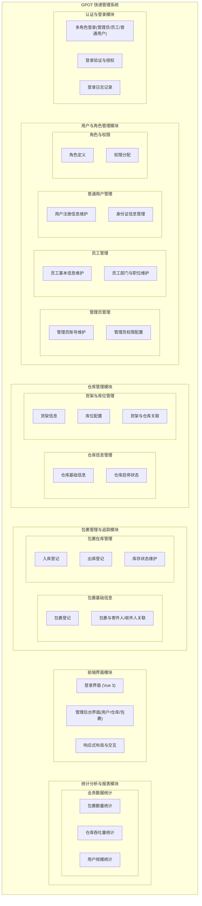

# GPOT 快递管理系统 - 功能模块图（竖向）

以下为竖向排布的功能模块图，可在支持 Mermaid 的编辑器中预览，或复制到 [Mermaid Live Editor](https://mermaid.live) 导出为图片。

## 模块说明（自上而下）

1. **认证与登录模块**：多角色登录、登录验证与授权、登录日志记录  
2. **用户与角色管理模块**：管理员管理、员工管理、普通用户管理、角色与权限  
3. **仓库管理模块**：仓库信息管理、货架与库位管理  
4. **包裹管理与追踪模块**：包裹基础信息、包裹在库管理  
5. **前端界面模块**：登录界面、管理后台界面、响应式布局与交互  
6. **统计分析与报表模块**：业务数据统计（包裹数量、仓库吞吐量、用户规模）
